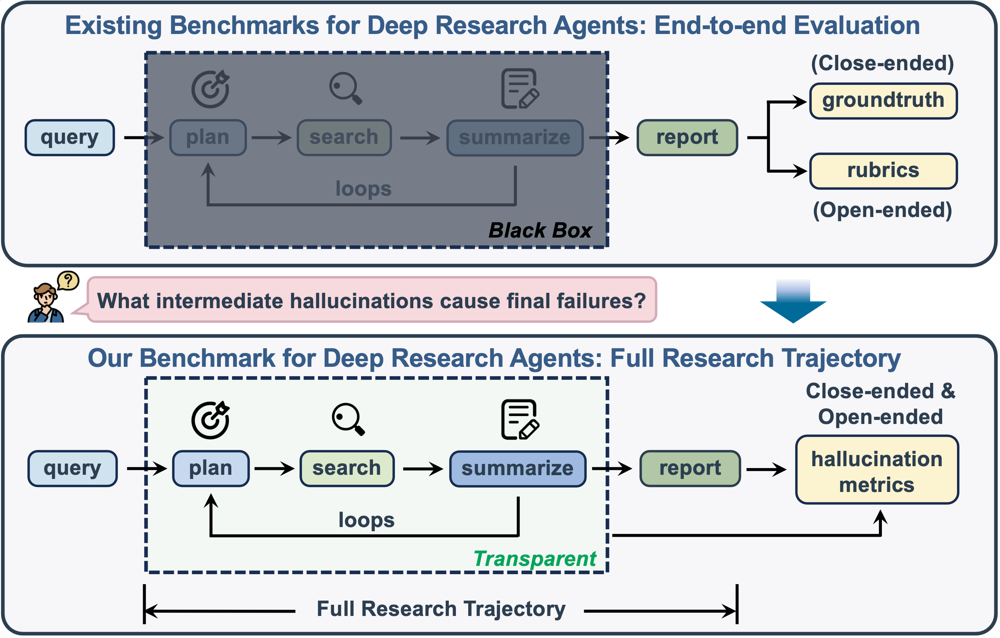

# DeepHalluBench

**Hallucination Evaluation for Deep Research Agents**

A process-aware evaluation framework for detecting and quantifying hallucinations in full research trajectories using the **PING Taxonomy**.



## PING Taxonomy

| Category | Description | Error Types |
|---|---|---|
| **P**ropagation | Cascading errors from earlier hallucinations | Trajectory-level propagation |
| **I**ntent | Planning-stage failures | Restriction neglect, Action deviation |
| **N**oise-induced | Failure to prioritize informative evidence | Neglected important retrieval |
| **G**rounding | Claims unsupported by evidence | Fabrication, Misattribution |

## Installation

```bash
pip install -r requirements.txt
playwright install chromium
```

## Quick Start

### 1. Set up API key

```bash
export LLM_API_KEY="your-api-key"
export LLM_PROVIDER="deepseek"      # openai, anthropic, aliyun, deepseek
export LLM_MODEL="deepseek-v4-flash"
export LLM_BASE_URL="https://api.deepseek.com"
```

Optional environment variables:

```bash
export NLI_THRESHOLD=0.95            # NLI confidence threshold
export GPU_IDS="0"                   # Comma-separated GPU IDs
export CACHE_DIR="./cache"           # Intermediate cache directory
export OUTPUT_DIR="./results"        # Results output directory
```

### 2. Prepare your trajectory JSON

The evaluation accepts JSON files with the following format (see `demos/apple_watch.json` for a complete example):

```json
{
    "query": "Your research question",
    "final_report": "The agent's final report text",
    "all_source_links": ["https://source1.com", "https://source2.com"],
    "summary_citations": ["https://cited1.com"],
    "reasoning_1": "Initial reasoning and planning text",
    "search_1": [
        {"text": "chunk content", "url": "https://source.com/page"}
    ],
    "reasoning_2": "Observation and next steps",
    "search_2": [...],
    ...
}
```

Keys `reasoning_N` and `search_N` can be at the top level or nested under `chain_of_research`.

### 3. Run evaluation

```bash
# Single file
python -m eval_framework.evaluate demos/apple_watch.json

# All JSON files in a directory
python -m eval_framework.evaluate demos/ --output-dir ./results

# Quick demo mode (sample fewer claims/actions to save cost)
python -m eval_framework.evaluate trajectory.json --sample-claims 10 --sample-actions 5
```

Results are saved to `./results/evaluation_<filename>.json` along with intermediate caches in `./cache/`.

### Skip specific steps

```bash
python -m eval_framework.evaluate trajectory.json --skip-noise --skip-actions
```

## Output Format

```json
{
  "query": "User's research query",
  "ping_scores": {
    "grounding": 0.12,
    "noise_induced": 0.08,
    "intent": 0.15,
    "propagation": 0.05
  },
  "overall_score": 0.10,
  "detailed_results": {
    "claim_verification": {
      "total": 45, "support": 38, "fabrication": 5, "misattribution": 2
    },
    "action_verification": {
      "total": 12, "deviation": 2, "propagation": 1
    },
    "noise_domination": {
      "score": 0.08
    },
    "constraint_checking": {
      "total_queries": 5, "missed_count": 1
    }
  }
}
```

## Python API

```python
from eval_framework import DeepHalluBench

evaluator = DeepHalluBench.from_env()
results = evaluator.evaluate("trajectory.json")
print(results["ping_scores"])
print(f"Overall: {results['overall_score']:.4f}")
```

## Project Structure

```
DeepHalluBench/
├── eval_framework/             # Main evaluation package
│   ├── __init__.py             # DeepHalluBench evaluator
│   ├── evaluate.py             # CLI entry point
│   ├── config.py               # Configuration (env vars / JSON)
│   ├── core/
│   │   ├── decomposition.py    # Trajectory → atomic units
│   │   ├── claim_verification.py  # Grounding (NLI→LLM cascade)
│   │   ├── action_checking.py  # Intent detection
│   │   ├── noise_domination.py # Noise-induced detection
│   │   └── constraint_checking.py  # Restriction neglect
│   └── utils/
│       ├── __init__.py         # LLM API client
│       ├── scoring.py          # BGE reranker utilities
│       └── web_fetcher.py      # Web content fetching
├── parsers/                    # HTML trace parsers (OpenAI, Grok, etc.)
├── demos/                      # Example trajectory files
└── data/                       # Benchmark queries
```

## Citation

```bibtex
@article{zhan2026your,
  title={Why Your Deep Research Agent Fails? On Hallucination Evaluation in Full Research Trajectory},
  author={Zhan, Yuhao and Fan, Tianyu and Huang, Linxuan and Guo, Zirui and Huang, Chao},
  journal={arXiv preprint arXiv:2601.22984},
  year={2026}
}
```

## License

MIT
